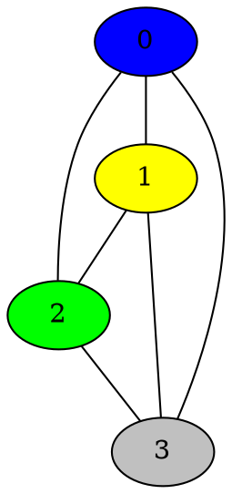

# Graph Coloring 
[](https://travis-ci.org/ob-algdatii-ss18/leistungsnachweis-hornet)
[](https://coveralls.io/github/ob-algdatii-ss18/leistungsnachweis-hornet?branch=master) 
[Website](https://ob-algdatii-ss18.github.io/leistungsnachweis-hornet/) |
[Documentation](https://ob-algdatii-ss18.github.io/leistungsnachweis-hornet/doc/index.html)

# Beschreibung
Zu einem gegebenen Graphen und einer gegebenen Anzahl an Farben wird ermittelt, ob und wie dieser Graph mittels der gegebenen Farben so gefaerbt werden kann, dass kein Knoten die selbe Farbe besitzt wie einer seiner Nachbarn besitzt.

Dieser Graph wird mittels graphviz visualisiert.

# Description
For a given graph and an amount of given colors it should be checked if the Graph could be colored in such a way that no node has a neighbor with the same color.

This graph is then visualized with graphviz.

# Build Instructions

```sh
cmake -H. -Bbuild
cd build
cmake --build .
ctest
```

# Usage Information

Execute the project and follow the instructions.

# Example
*green lines are input*
```diff
D:\Studium\algodatii\cmake-build-debug\leistungsnachweis-hornet.exe
enter number of nodes
+ 4
Your graph has 4 Nodes.
Please enter the Connections each node has, set 1 for a connection, 0 for none.
Please seperate your input with a blank.
0 1 2 3 
+ 1 1 1 1
+ 1 1 1 1
+ 1 1 1 1
+ 1 1 1 1
Please enter the number of colors.
+4

Process finished with exit code 0
```

output dot file:


output image visualization:


